## Итоговая аттестация

### Информация о проекте
Необходимо организовать систему учета для питомника, в котором живут
домашние и вьючные животные.

Проект состоит из 2 частей:
 - Linux - Выполнить в командной строке + uml-диаграмма + sql запросы
 - Программа на Java - Необходимо написать программу, для розыгрыша игрушек в магазине детских товаров.

Эти 2 части не взаимосвязанные. 
 
Подробное описание задач – ниже.

### Проект
 - Первая часть по Linux указана в файле README.md В заголовке "Задание 1" (см.ниже) 
 - Вторая часть uml-диаграмма
 - Вторая часть программы на Java –  в папке src
 по ссылке на Github.   

### Задание 1 

1)  Используя команду cat в терминале операционной системы Linux, создать
два файла Домашние животные (заполнив файл собаками, кошками,
хомяками) и Вьючные животными заполнив файл Лошадьми, верблюдами и
ослы), а затем объединить их. Просмотреть содержимое созданного файла.
Переименовать файл, дав ему новое имя (Друзья человека). 
__________________________________
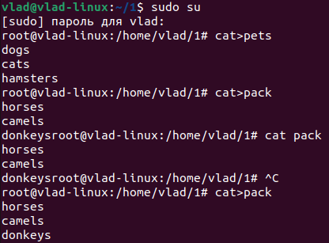

<!-- cat>pets
dogs
cats
hamsters

cat>pack
horses 
camels
donkeys -->

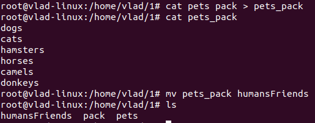

<!-- cat pets pack > pets_pack
cat pets_pack
dogs
cats
hamsters
horses
camels
donkeys
mv pets_pack humansFriends -->
__________________________________
2)  Создать директорию, переместить файл туда.

   ________________________________
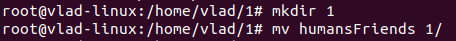

<!-- mkdir 1
mv humansFriends 1/ -->
   ________________________________
   
3)  Подключить дополнительный репозиторий MySQL. Установить любой пакет
из этого репозитория. (Примечание от преподавателя: необходимо создать субд MySQL, где будет храниться информация по друзьям человека)

   ________________________________
  apt update
  apt install mysql-server
  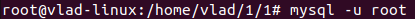
    
  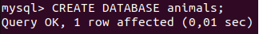

  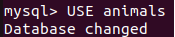

  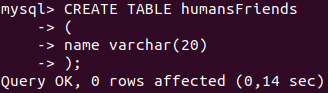
    <!-- CREATE TABLE humansFriends
    (
        name varchar(20)
    ); -->
  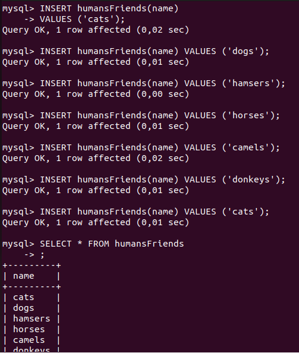
<!-- INSERT humansFriends(name)
VALUES ('cats');
INSERT humansFriends(name)
VALUES ('dogs');
INSERT humansFriends(name)
VALUES ('hamsters');
INSERT humansFriends(name)
VALUES ('horses');
INSERT humansFriends(name)
VALUES ('camels');
INSERT humansFriends(name)
VALUES ('donkeys'); -->
   ________________________________
4)   Установить и удалить deb-пакет с помощью dpkg
   ________________________________

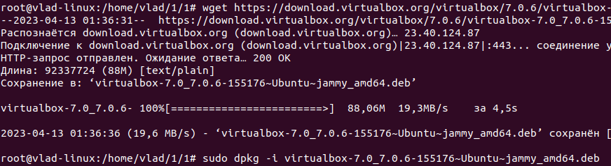

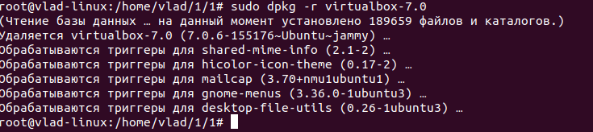

6) Нарисовать диаграмму, в которой есть класс родительский класс, домашние
животные и вьючные животные, в составы которых в случае домашних
животных войдут классы: собаки, кошки, хомяки, а в класс вьючные животные
войдут: Лошади, верблюды и ослы).

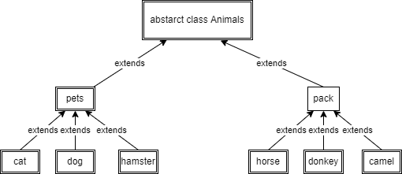
    
   __________________________________________________
7)   В подключенном MySQL репозитории создать базу данных “Друзья
человека”
_______________
 
 _________

8)   Создать таблицы с иерархией из диаграммы в БД

   ________________________________
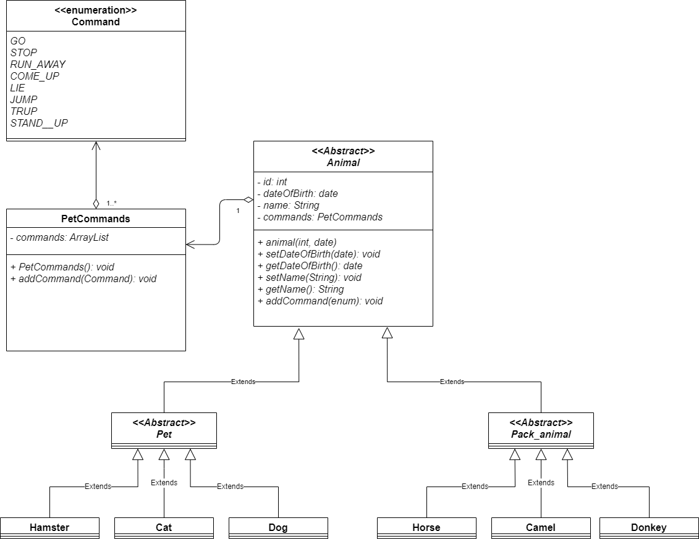
   ________________________________

9) Заполнить низкоуровневые таблицы именам (животных), командами, которые они выполняют и датами рождения
__________________
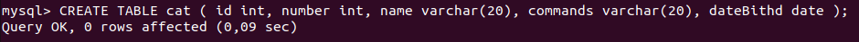
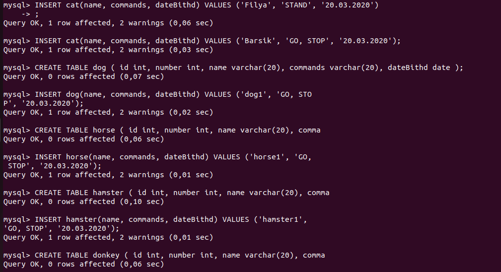
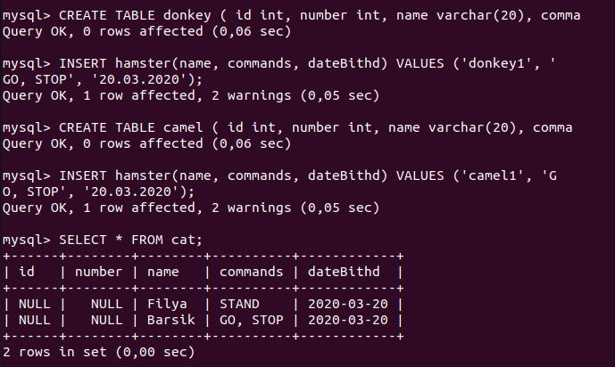
______________

10) Удалив из таблицы верблюдов, т.к. верблюдов решили перевезти в другой
питомник на зимовку. Объединить таблицы лошади, и ослы в одну таблицу.

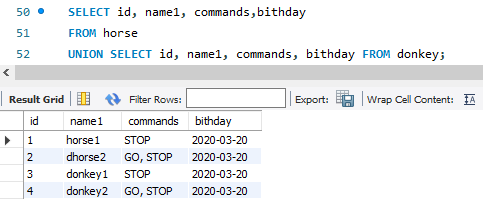

11) Создать новую таблицу “молодые животные” в которую попадут все
животные старше 1 года, но младше 3 лет и в отдельном столбце с точностью
до месяца подсчитать возраст животных в новой таблице

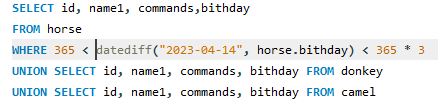

12) Объединить все таблицы в одну, при этом сохраняя поля, указывающие на
прошлую принадлежность к старым таблицам.
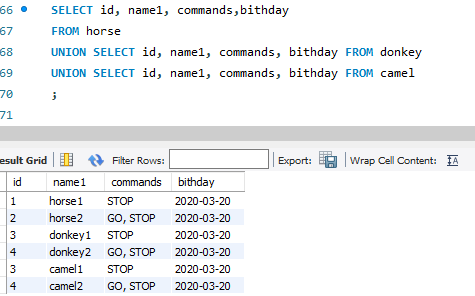

### Задание 2

Написание программы, имитирующую работу реестра домашних животных

Программа приложена